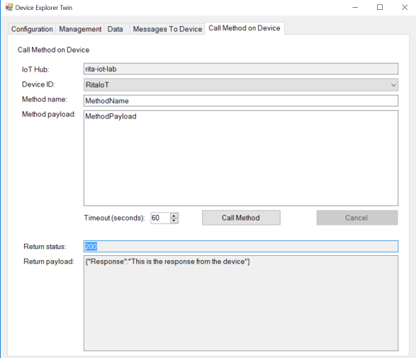

# ESP8266 RTOS SDK with Azure IoT C SDK


The [ESP8266](https://en.wikipedia.org/wiki/ESP8266) is a low-cost Wi-Fi chip with full TCP/IP stack and MCU (Micro Controller Unit) capability produced by Espressif Systems. 

The [ESP8266 RTOS SDK version v1.5](https://github.com/espressif/ESP8266_RTOS_SDK) is based on FreeRTOS. This repo integrates ESP8266 RTOS SDK version 1.5 commit [bbdf366](https://github.com/espressif/ESP8266_RTOS_SDK/commit/bbdf36667a04af6786c80f8cc34fdc46a2447706) with the [Azure IoT C SDK version 1.1.3](https://github.com/Azure/azure-iot-sdk-c) to stream data from ESP8266 to Azure IoT using MQTT protocol.

## Installation / Dependencies

Get Build Environment:
- Follow this [guide](https://espressif.com/en/support/explore/get-started/esp8266/getting-started-guide)
- Under section 3.3. ESP8266 Toolkit, download VirtualBox and the lubuntu image.
- Make sure to share a local folder with the VM

Get esptool.py on your host machine:
- Follow this [guide](https://github.com/espressif/esptool)

Clone this repo within the shared folder on your host:

    git clone https://github.com/ritazh/ESP8266-Azure-IOT

## Setup Azure IoT

To stream data to Azure IoT, you need to provision an Azure IoT Hub and an IoT Hub device. Follow this [guide](http://thinglabs.io/workshop/esp8266/setup-azure-iot-hub/). Once you have completed this step, make sure to copy the device-specific connection string for testing later.

## Update Variables

Update the following files within this solution:

[/examples/project_template/user/user_main.c](https://github.com/ritazh/ESP8266-Azure-IOT/blob/master/examples/project_template/user/user_main.c)

Update these values with your own wifi ssid and password for ESP8266 to connect to

```
uint8 ssid[] =
uint8 password[] =
```

[/examples/project_template/gen_misc4.sh](https://github.com/ritazh/ESP8266-Azure-IOT/blob/master/examples/project_template/gen_misc4.sh)

Update these variables to the path of the shared folder on the VM

```
export SDK_PATH=~/ESP8266-Azure-IOT
export BIN_PATH=~/ESP8266-Azure-IOT/bin
```

[/examples/project_template/user/iothub_client_sample_mqtt.c](https://github.com/ritazh/ESP8266-Azure-IOT/blob/master/examples/project_template/user/iothub_client_sample_mqtt.c)

Update the `connectionString` variable to the device-specific connection string you got earlier from the `Setup Azure IoT` step:

```
static const char* connectionString = '[azure connection string]'
```

The azure connection string contains `Hostname`, `DeviceId`, and `SharedAccessKey` in the format:

`"HostName=<host_name>;DeviceId=<device_id>;SharedAccessKey=<device_key>"`
   
## Compile

Now you are ready to compile
From the VM, run the following command from a terminal:

    ./gen_misc4.sh


Once compliation is completed successfully, you should see something that looks like the following:

```
bin crc: 1a38d19
Support boot_v1.4 and +
Generate user1.4096.new.6.bin successully in BIN_PATH
boot.bin------------>0x00000
user1.4096.new.6.bin--->0x01000
!!!
```
## Flash

Now you are ready to flash the binaries to your ESP8266. From your host machine, cd into `/bin`. 

Run the following command on the host to flash the binaries to ESP8266 using:

```
esptool.py --port /dev/cu.SLAB_USBtoUART  write_flash --flash_freq 40m --flash_mode qio --flash_size 32m-c1 0x1000 ./upgrade/user1.4096.new.6.bin 0x0 ./boot_v1.5.bin 0x3FC000 ./esp_init_data_default.bin 0x3FE000 ./blank.bin
```

## Test Your Setup

To test that the sample application is streaming data to Azure IoT, download the [iothub-explorer](https://github.com/Azure/iothub-explorer) on your computer. Use the device-specific connection string you got earlier from the [Setup Azure IoT section](https://github.com/ritazh/ESP8266-Azure-IOT#setup-azure-iot) to get messages received by Azure IoT. Run the following from terminal:

```
iothub-explorer '[azure connection string]' monitor-events [DeviceId]
```

The azure connection string contains `Hostname`, `DeviceId`, and `SharedAccessKey` in the format:

`"HostName=<host_name>;DeviceId=<device_id>;SharedAccessKey=<device_key>"`

To view logs generated by the application, you can install [ESPlorer](https://esp8266.ru/esplorer/). Note: make sure to set the `baud rate` to `115200` within the ESPlorer tool.

## Update Your Code

To customize this sample solution for your own use, update `/examples/project_template/user/iothub_client_sample_mqtt.c` with your own data to stream and your own logic.

## What's in the Sample?

In the [mqtt sample](https://github.com/ritazh/ESP8266-Azure-IOT/blob/master/examples/project_template/user/iothub_client_sample_mqtt.c), it continues to send messages to Azure, until cloud sends a "quit" message to end the program. Before the program ends, you can send any message to the device by using the [iothub-explorer](https://github.com/Azure/iothub-explorer) like the following:

```
To send a message to a device named "RitaIoT":
iothub-explorer send RitaIoT "hello3" --ack=full

To quit the sample:
iothub-explorer send RitaIoT "quit" --ack=full
```
You can also send a direct method request to invoke a direct method on the device. For example, using [Device Explorer](https://github.com/Azure/azure-iot-sdk-csharp/tree/master/tools/DeviceExplorer) to call a method and the method will return a payload:


## License
Licensed as MIT - please see LICENSE for details.
